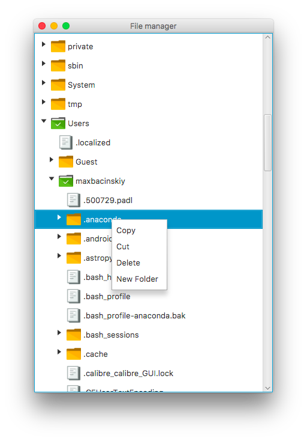

# FxManager
Файловый менеджер, написанный на языке Java с использованием JavaFx для отрисовки графического интерфейса. В качестве корневого элемента использованы классы TreeView, TreeItem и TreeCell.
Проект является тестовым заданием на позицию Java Intern в компанию Сплат.
## Формулировка тестового задания
Начальный уровень.
Реализовать файловый менеджер на языке Java.
Отображающий файловую систему в виде дерева.

Приложение должно иметь интуитивно понятный интерфейс и обладать следующими функциями файлового менеджера:
- навигация по дереву файловой системы (DONE)
- создание нового каталога (DONE)
- иконки должны соответствовать состоянию папки (закрыта, раскрыта) (DONE)
- иконки для файлов (DONE)

Дополнительное задание:
Реализовать следующую функциональность:
- «ленивую» загрузку папок, искусственно добавить задержку 2 секунды при раскрытии папки задав такой папке иконку загрузки, 
при этом приложение не должно «замораживаться» (DONE) (Примечение: ленивая загрузка работает только при первом открытии папки, 
в следующие разы внутренности папки уже загружены, поэтому загружать больше нечего)
- добавление схожих функций с «Проводником Windows» на ваше усмотрение.

На свое усмотрение я добавил следующие функции:
- Копирование, вставка, удаление файлов/папок по правому клику мыши.
- Переименование файлов

## Скриншоты
 
